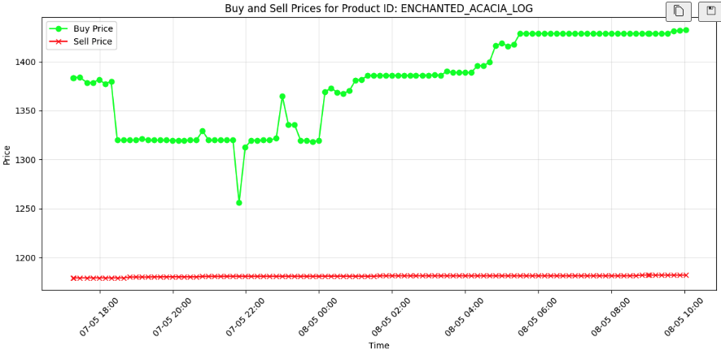

# Hypixel Bazaar 

## basic idea
Within Minecraft there is the server Hypixel on which there is a Game Mode called Skyblock which then has a feature called **the Bazaar**.

This Bazaar is essentially a free market with minimal tax with over a thousand different ressources being traded. The volumes of ressouces offered vary heavily between each category but the total volume is in the high millions if not bilions.

## ok, but what is this?
Sir, this is a wendys. 

Or rather a kids game. With limited things to do. And real time trade.

Which now brings me to my point: It can not be that hard to analyse the trades and find patterns within this limited scope, right?

Well this is what im trying to find out.

## Metrics involved
### ressource metrics
- sell / buy price
- sell / buyvolume
- sold / bought in past 7 days

### temporal metrics
there are events happening from time to time that are set to happen which makes it more profitable for a player to farm a certain ressource at a certain time, increasing the volumes etc. These are scheduled and completely predictable.

- Farming Contests (Potatoes, Carrots etc)
- Fishing Contests
- Mayors


## Method
### naïve Method
By looking at the data, so mainly prices and volumes as well as some Events in the game that are too complex to add to the data - at least as of now with this rather small quantity of data -, i am hoping to recognize some small level of logic.

### numerical Method
Applying the **Fast Fourier Transformation** to the prices or volumes gives me the opportunity to figure a score from 0 - 1 for the **level of periodicity** in that scope. As well as find a subset with **dominant frequencies**.

### ML Method
There are several interesting models for this, for now the **Meta Prophet** model will be trained on this data and used to attempt predictions. The Prophet model is easy and quick to train. I will train it and then have it run in the background and automatically rate the performance with the actual future data in hopes of determening the models strengths and weaknesses.


## Usage
- clone this repository
    - ```git clone https://github.com/hannesmoehring/hypixel_bazaar.git```
- create a virtual enviroment, i have been using ```Python3.13```
    - ```python3.9 -m venv venv_3_9```
- activate the virtual environment (this part should work for mac and linux, look it up for windows)
    - ```cd hypixel_bazaar && source venv_hb/bin/activate```
- proceed to install all needed dependencies 
    - ```pip install -r requirements.txt```
- now the notebook should be available as well as all the utility files, have fun


## examples

- First plotting on test data for an item
    - 